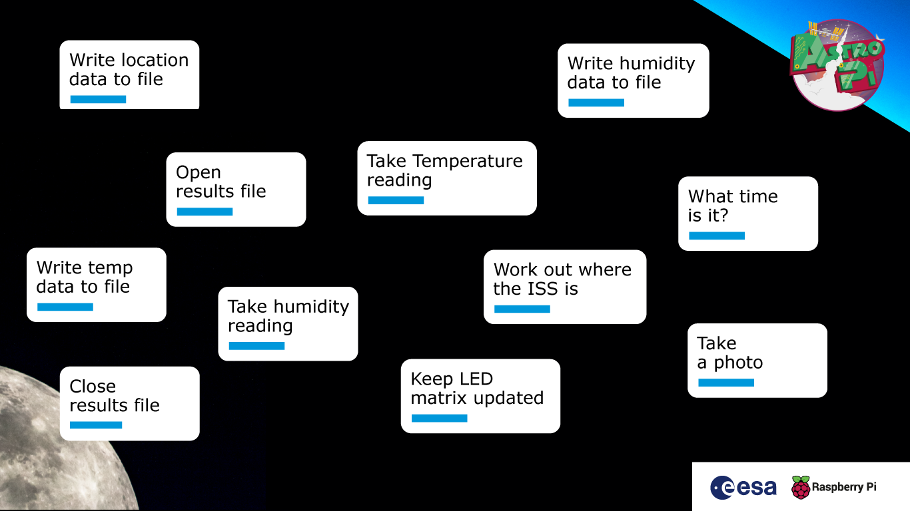
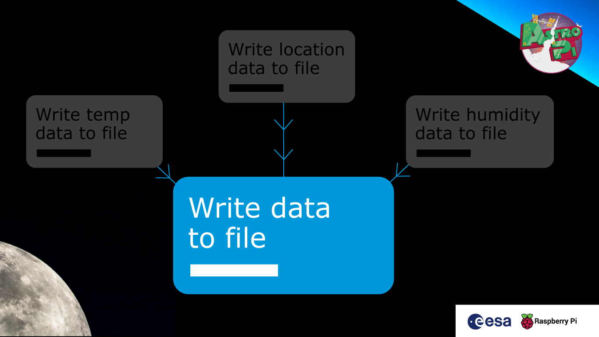
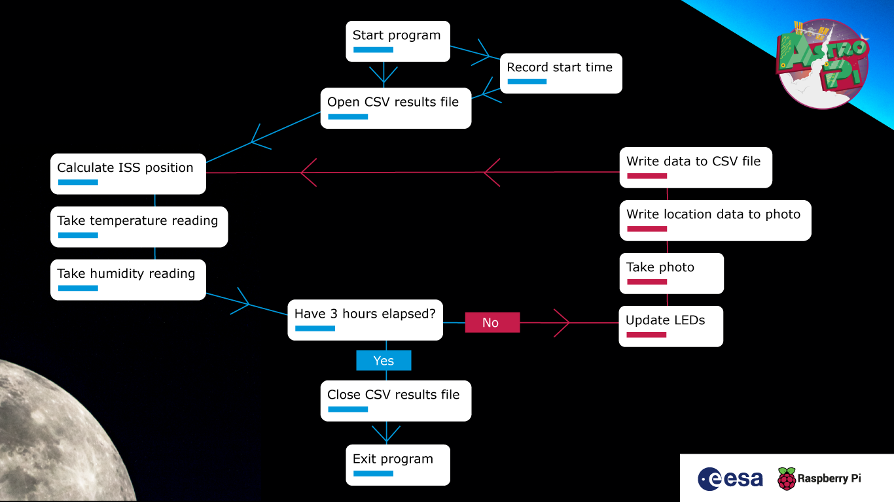

## Tips for educators — planning and running your coding sessions

Here is an example of an Astro Pi Mission Space Lab experiment idea, which we’ll use to illustrate how to plan and write your computer program (this is the same experiment that we're showing the program for in the step 'A big worked example').

The team from CoderDojo Tatooine wants to investigate whether the environment on the ISS is affected by the surface of the Earth it is passing over. Does the ISS get hotter when it passes over a desert, or wetter (more humid) when it is above the sea?

Their computer program should:
- Take regular measurements of temperature and humidity every 30 seconds, and log the values in a CSV file.
- Calculate the ISS’s latitude and longitude using the PyEphem library, and log this information in the CSV file.
- Take a photo using the IR camera on Astro Pi computer Izzy, which is pointing out of a window towards Earth, to gather data on whether cloud cover might also be a factor.
- Write the latitude and longitude data into the EXIF tags of the images, which have sequentially numbered file names.
- Update the Astro Pi’s LED matrix every 15 seconds.
- Handle any unexpected errors and log the details.

### How to approach writing the program for Phase 2 of Mission Space Lab

+ Start by looking at the coding guidelines in the previous steps.  They contain a few things that your program should do so that it can run smoothly on the Astro Pis on the ISS, along with some useful tips for how to make the most of your experimental results. There are also a few strict rules, such as making sure that all photos Astro Pi Ed takes of the inside of the ISS are deleted at the end of your experiment.

Remember, these are some key things that the program should do:

1. The complete program should be in a single file.
1. Results should be saved to a CSV file.
1. Photos from Astro Pi Izzy should have the ISS location information added to their metadata.
1. The use of multiple threads should be avoided.
1. The Astro Pi’s LED matrix should be regularly updated to indicate that a program is working.
1. The program should finish after 3 hours.

### Figure out the key tasks

+ Get your team together and start to map out the rough outline of how your program will work. You can do this as a group and have everyone call out their ideas, or let the team members work individually and then get everyone together to compare results.

+ Use a whiteboard or big sheet of paper to list all the key tasks that your program will need to perform. You don’t need to worry about the order or the actual functions and commands at this stage — just note down the specific things that need to be achieved. This is what that would look like for the example scenario above:

+ Now have a closer look at each task and think about whether it can be split down into smaller sub-tasks. Moreover, are there any actions that can be sensibly combined with one another? Also see if there are any tasks that need to be repeated.

+ Now try to put everything into a logical order, using lines to connect the various tasks. It will start to get messy, but that’s good! You will probably discover that there are some obvious repeated tasks. This is a good time to introduce or reinforce the programming concepts of repetition and loops.

+ If there are any repeated tasks, do they appear just once in your diagram, with flow lines passing through many times, or do they fit in in multiple places? Talk with your team about how repeated tasks should only be coded once, so that parts of the program can be reused.

### Create a flow chart

+ Take a fresh sheet of paper or find a clean area on your whiteboard (be sure to copy or take a photo of your first picture before erasing anything). Reconfigure the steps and flow into a more ordered diagram, maybe running clockwise around the paper or starting at the top and working downwards. Try a few different versions and see which one is the most easy to follow. Include a ‘start’ and ‘end’ block to make it very clear where the program begins and finishes. Are there any actions you need to perform at these stages (e.g. clear the LED matrix)?

The final result is what is called pseudo-code: a diagram of all of a program’s tasks, in the right order, that doesn’t contain any actual programming language commands.

+ Now work through your task list and try to identify any missing pieces.

+ Also think about where in your program you should be looking to handle exceptions and errors. Most experiments will have a main loop that runs repeatedly over the 3 hour period. An unexpected error encountered in this loop could be disastrous if it causes the program to stop or stall and prevent further data collection. So come up with some ‘what if’ scenarios. For example, if you’re reading data from a sensor, what will happen if it gives you an unexpected result? Will your program cope with this? How are you dealing with hardware errors?

+ Add in any missing functionality into your pseudo-code.

### Assign tasks to members of the team

+ Give descriptive names to each task block.

+ Assign responsibility for each block to different members of the team. Try to think about the individual team members’ experience levels and programming ability and allocate tasks accordingly. Depending on the number of people in your team and the complexity of your program, it may be sensible to have more than one person allocated to a specific block or function.

+ And don’t forget that someone needs to be responsible for the scaffold of the final program that will contain the various function calls in the right order.

### Get coding!

+ You will probably discover that some functions are really easy to create using the recommended Python libraries, perhaps even with only a single line. Others will be more complex, and we have included some useful code snippets in the coding requirements document (e.g. for adding latitude and longitude information to the EXIF data of a photo) that you can copy into your project. To design more complicated functions, if needed, you can use the same pseudo-code approach you went through with the program as a whole.

+ Remind your team that they cannot install additional Python libraries or access the internet on the Astro Pi computers aboard the ISS, so they should not use any commands that make a web request or look up something from an online source.

+ Encourage each team member or sub-team responsible for a specific part of the program to code their section so that works by itself, just like the examples in the coding requirements document. Suggest that they add comments and docstrings as they go along.

+ Get together regularly to discuss progress and work through any major challenges as a group. It is worth updating your pseudo-code flow diagram to reflect any changes that your team realise are necessary as they write the actual program.

+ Keep the deadline for submitting your program in mind. If time is running out, are there any parts of your program that can be left out? If you are planning on performing analysis of results in real time, can this instead be done after your program has run, when you’ve got your results back?

### Test your program

+ Don’t forget to test your program using the Flight OS disk image, which is the operating system running on the Astro Pis. It’s a cut-down version of the Raspbian OS, and it does not have X-Windows and many of the standard development tools installed. Testing your program using the Flight OS will let you check that none of the commands rely on files or libraries that aren’t present on the Astro Pis aboard the ISS.

